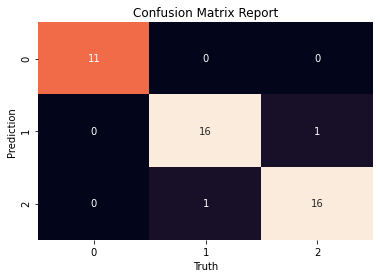

# Iris Dataset Specie Predictor : Project Overview

* Predicted the specie of iris flowers based some of their features

* Got a Test Accuracy of **96%**

* Used Logisitic Regression as model, since problem was a Classification

___
### Code and Resources Used
* Python Version: 3.8
* Packages: pandas, numpy, matplotlib, seaborn, sklearn
* Dataset: Iris Dataset

___
### Features
* Sepal length (cm)
* Sepal width (cm)
* Petal length (cm) 
* Petal width (cm)

### Target
* Species 
    * 0 - Setosa
    * 1 - Versicolor
    * 2 - Virginica 
___

### Model Building

I spli the test and train set 70% and 30% respectively

I used **Logisitic Regression** as the algorithm for the model
___

### Model Performance
The model performed well with the following with the following metrics
* Test Accuracy - 96%

| Specie  | precision | recall  | 
|---------|-----------|---------|
| 0       | 1.00      | 1.00    | 
| 1       | 0.94      | 0.94    | 
| 2       | 0.94      | 0.94    | 

* Confusion Matrix

